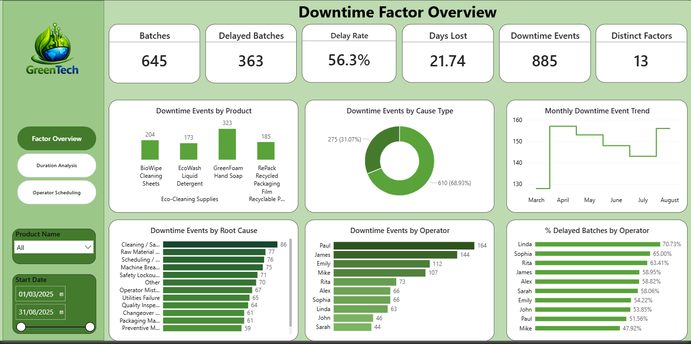
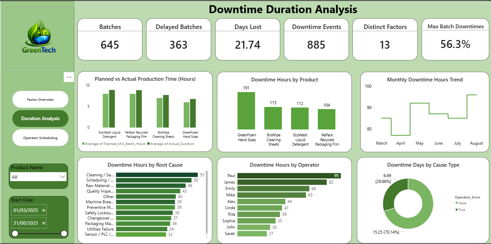
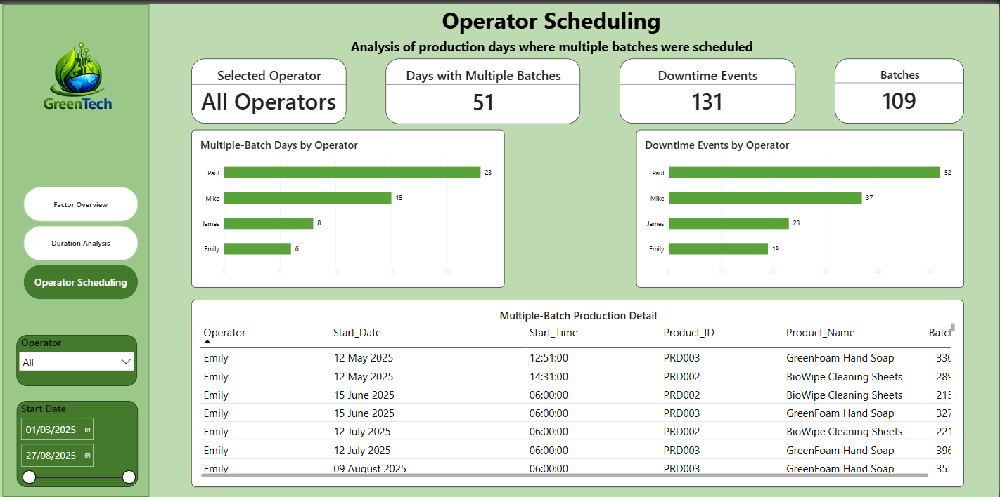

# 🌱 GreenTech Manufacturing — Production Downtime Analytics

## 📌 Project Overview

This project analyses manufacturing production downtime at **GreenTech Manufacturing** to identify operational bottlenecks, quantify production time lost, investigate recurring downtime factors, and examine how products, operators, and scheduling patterns relate to production delays.

The analysis combines **SQL Server** for data preparation and analytical querying with **Power BI** for interactive reporting and visualisation.

The project follows three complementary analytical perspectives:

1. **Downtime Factor Analysis** — What factors occur most frequently?
2. **Downtime Duration Analysis** — Where is the greatest amount of production time being lost?
3. **Operator Scheduling Analysis** — How are multiple-batch production days associated with downtime activity?

---

## 🎯 Business Problem

Manufacturing downtime can reduce production capacity, disrupt schedules, increase operating costs, and affect overall process efficiency.

GreenTech required an analytical approach capable of answering questions such as:

- How many production batches experienced downtime?
- What proportion of batches were delayed?
- Which downtime factors occurred most frequently?
- Which factors generated the greatest production-time loss?
- Which products experienced the most downtime activity?
- How was downtime distributed across operators?
- How did downtime change over time?
- What patterns exist on days where operators handled multiple batches?
- Which operational areas should management investigate first?

---

## 📊 Headline KPIs

| KPI | Result |
|---|---:|
| Total Production Batches | **645** |
| Delayed Batches | **363** |
| Delay Rate | **56.3%** |
| Downtime Events | **885** |
| Distinct Downtime Factors | **13** |
| Total Production Days Lost | **21.74 days** |
| Maximum Downtime Events per Batch | **4** |

More than half of the production batches experienced at least one recorded downtime factor during the analysis period.

---

# 📈 Power BI Dashboard

The Power BI report contains three analytical pages designed to move from overall downtime frequency to production-time impact and finally to scheduling context.

---

## 1️⃣ Downtime Factor Overview



This page provides an overview of downtime frequency across products, root causes, operators, and time.

### Key Metrics

- **645** total batches
- **363** delayed batches
- **56.3%** delay rate
- **885** downtime events
- **13** distinct downtime factors
- **21.74** production days lost

### Key Analysis

The dashboard examines:

- Downtime events by product
- Operator-related vs non-operator-related events
- Monthly downtime event trends
- Downtime frequency by root cause
- Downtime frequency by operator
- Delayed-batch percentage by operator

### Product Downtime Frequency

| Product | Downtime Events |
|---|---:|
| GreenFoam Hand Soap | **323** |
| BioWipe Cleaning Sheets | **204** |
| RePack Recycled Packaging Film | **185** |
| EcoWash Liquid Detergent | **173** |

**GreenFoam Hand Soap** recorded the highest number of downtime events.

Event frequency alone, however, should not be interpreted as proof that a product is inherently less efficient because production volume and downtime duration also need to be considered.

---

## 2️⃣ Downtime Duration Analysis



While the first dashboard examines **how often downtime occurs**, this page focuses on **how much production time is lost**.

This distinction is important because a frequently occurring problem may not necessarily generate the greatest operational impact.

### Analysis Includes

- Planned vs actual production duration
- Downtime hours by product
- Monthly downtime-hours trend
- Downtime hours by root cause
- Downtime hours by operator
- Operator-related vs non-operator-related downtime

### Operator vs Non-Operator Downtime

| Cause Type | Days Lost | Share |
|---|---:|---:|
| Non-Operator Factors | **15.25 days** | **70.14%** |
| Operator-Related Factors | **6.49 days** | **29.86%** |

The majority of total downtime duration was associated with **non-operator factors**.

This suggests that production improvement initiatives should consider broader operational issues such as equipment reliability, materials, cleaning processes, scheduling, and other process constraints rather than focusing solely on operator-related causes.

---

## 3️⃣ Operator Scheduling Analysis



This page examines production activity specifically on days where operators were scheduled for **multiple batches**.

The page is filtered to:

**MultipleBatchPerDay = TRUE**

### Scheduling KPIs

| KPI | Result |
|---|---:|
| Days with Multiple Batches | **51** |
| Distinct Batches | **109** |
| Downtime Events | **131** |

### Multiple-Batch Days by Operator

| Operator | Multiple-Batch Days |
|---|---:|
| Paul | **23** |
| Mike | **15** |
| James | **8** |
| Emily | **6** |

### Downtime Events Within the Multiple-Batch Context

| Operator | Downtime Events |
|---|---:|
| Paul | **52** |
| Mike | **37** |
| James | **23** |
| Emily | **19** |

The **131 downtime events** reconcile exactly with the operator-level breakdown.

### Important Interpretation

Multiple-batch scheduling is treated as an **operational context**, not as proof of causation.

The SQL analysis found:

| Scheduling Context | Batches | Delayed Batches | Delay Rate | Downtime Events |
|---|---:|---:|---:|---:|
| Multiple-Batch Operator-Day | **109** | **52** | **47.71%** | **131** |
| Single-Batch Operator-Day | **536** | **311** | **58.02%** | **754** |

The delayed-batch rate was actually lower within the multiple-batch context than for single-batch operator-days.

Therefore, the available data **does not support a conclusion that multiple-batch scheduling itself increases the probability of production delays**.

Further analysis would be required to isolate the effects of workload, product mix, equipment, shift conditions, staffing, and other potential confounding factors.

---

# 🔍 Root Cause Analysis

The analysis identified several recurring downtime causes across the production environment.

Prominent causes included:

- Cleaning / Sanitation
- Raw Material Shortage
- Scheduling / Coordination
- Machine Breakdown
- Safety Lockout
- Preventive Maintenance
- Utilities Failure
- Quality Inspection
- Changeover activities
- Packaging-related issues

One important analytical distinction was maintained throughout the project:

> **Downtime frequency and downtime duration measure different aspects of operational performance.**

A factor that occurs frequently may consist of relatively short interruptions, while another factor occurring less frequently may generate substantially more production-time loss.

For this reason, both event counts and downtime hours were analysed.

---

# 👷 Operator Analysis

Operator performance was examined from multiple perspectives rather than using a single downtime metric.

The analysis considered:

- Production volume
- Delayed batches
- Delayed-batch rate
- Downtime-event frequency
- Downtime hours
- Products handled
- Root causes associated with production batches
- Multiple-batch scheduling exposure

Paul, James, Emily, and Mike recorded relatively high levels of downtime activity across several measures.

However, these results are treated as **operational exposure indicators rather than direct measures of individual performance or fault**.

Differences in workload, product allocation, equipment, scheduling, and production conditions may influence operator-level results.

---

# 📅 Monthly Downtime Trends

The analysis covered production activity from **March to August 2025**.

Monthly analysis was conducted separately for:

- Downtime-event frequency
- Delayed batches
- Downtime hours
- Downtime days

The results demonstrate why frequency and duration should not be treated as interchangeable measures.

A month with more downtime events does not necessarily have the greatest number of production hours lost.

---

# 💡 Key Business Insights

### 1. Production delays are widespread

**363 of 645 batches** experienced at least one recorded downtime factor, resulting in a **56.3% delayed-batch rate**.

### 2. Downtime represents substantial lost production capacity

Recorded downtime totalled approximately **21.74 production days**.

### 3. Non-operator factors account for most lost production time

Approximately **70.14%** of downtime duration was associated with non-operator factors, compared with **29.86%** for operator-related factors.

### 4. GreenFoam Hand Soap recorded the highest downtime-event frequency

GreenFoam accounted for **323 downtime events**, the highest among the four products analysed.

### 5. Recurring causes provide opportunities for targeted improvement

Cleaning/sanitation, material availability, scheduling/coordination, equipment breakdowns, and other recurring factors represent areas where operational improvements may reduce production losses.

### 6. Operator results require contextual interpretation

Higher downtime frequency for an operator should not automatically be interpreted as poorer individual performance because production workload, product mix, scheduling, equipment, and operating conditions may differ.

### 7. Multiple-batch scheduling does not establish causation

Although **131 downtime events** occurred within the multiple-batch scheduling context, the delayed-batch rate for these batches was **47.71%**, compared with **58.02%** for single-batch operator-days.

The analysis therefore treats scheduling as an area for monitoring and further investigation rather than a demonstrated cause of downtime.

---

# 🎯 Recommendations

Based on the analysis, GreenTech could consider the following operational actions:

### Supply Chain & Inventory

Strengthen material-availability monitoring and introduce appropriate low-stock alerts to reduce downtime associated with raw-material shortages.

### Cleaning & Changeover Processes

Review cleaning, sanitation, and changeover procedures to identify opportunities for standardisation and improved production sequencing.

### Preventive Maintenance

Prioritise equipment experiencing recurring breakdown-related downtime and evaluate maintenance effectiveness using **production hours recovered**, not only event counts.

### Scheduling Controls

Use multiple-batch workload indicators as planning signals while continuing to test whether scheduling changes materially affect downtime.

### Operator Support

Use root-cause context, workload, product mix, and equipment exposure when identifying training or process-support requirements.

### Monthly Downtime Review

Monitor the following KPIs together:

- Delay rate
- Downtime events
- Downtime hours
- Root-cause trends
- Product-level downtime
- Operator exposure
- Scheduling patterns

This provides a more balanced view of manufacturing performance than relying on a single KPI.

---

# 🗄️ SQL Analysis

SQL Server was used to transform the source data and create reusable analytical structures.

The SQL workflow includes:

- Source-data auditing
- Duplicate and null checks
- Unpivoting downtime-factor columns
- Production-duration calculations
- Creation of reusable analytical views
- KPI validation
- Root-cause analysis
- Product analysis
- Monthly trend analysis
- Operator analysis
- Multiple-batch scheduling analysis
- Executive-summary validation

### Key SQL Views

**`dbo.downtimes`**

Transforms the original downtime-factor columns into an event-level structure where each row represents a downtime occurrence.

**`dbo.batch_pd`**

Creates a production-level analytical dataset containing:

- Batch information
- Operator
- Product
- Production date/time
- Planned production duration
- Actual production duration
- Production overrun
- Batches per operator/day
- Multiple-batch indicator

**`dbo.vw_downtime_analysis`**

Combines production, product, downtime-factor, operator, and duration information into a reusable analytical view.

📄 [View SQL Analysis](sql/GreenTech_Production_Downtime_Analysis.sql)

---

# 🛠️ Tools & Technologies

| Tool | Application |
|---|---|
| **SQL Server** | Data transformation, validation and analytical querying |
| **SQL** | Views, joins, CTEs, window functions, aggregation and UNPIVOT |
| **Power BI** | Interactive dashboards and analytical reporting |
| **DAX** | KPI measures and dashboard calculations |
| **Power Query** | Data preparation and transformation |
| **PowerPoint** | Executive presentation and communication of findings |
| **Git & GitHub** | Version control and portfolio documentation |

---

# 📂 Repository Structure

```text
GreenTech_Production_Downtime_Analytics/
│
├── data/
│   └── source datasets
│
├── powerbi/
│   └── GreenTech_Production_Downtime_Analytics.pbix
│
├── presentation/
│   └── GreenTech_Production_Downtime_Analysis.pptx
│
├── screenshots/
│   ├── 01_Downtime_Factor_Overview.png
│   ├── 02_Downtime_Duration_Analysis.png
│   └── 03_Operator_Scheduling.png
│
├── sql/
│   └── GreenTech_Production_Downtime_Analysis.sql
│
└── README.md
```

---

# 📑 Presentation

A management-focused presentation summarising the analysis, findings, operational implications, and recommendations is included in the repository.

📊 [View Presentation](presentation/GreenTech_Production_Downtime_Analysis.pptx)

---

# 🚀 Skills Demonstrated

This project demonstrates practical experience in:

- Manufacturing analytics
- SQL data transformation
- Relational data modelling
- SQL views and reusable analytical datasets
- KPI development
- DAX
- Power BI dashboard development
- Root-cause analysis
- Production downtime analysis
- Operational performance analysis
- Data validation and reconciliation
- Business insight generation
- Data storytelling
- Executive reporting
- Git/GitHub portfolio development

---

# 👤 Analyst

**Iheanyi Okwara**  
**Data Analyst**

This project forms part of my data analytics portfolio demonstrating the use of **SQL, Power BI, DAX, data modelling, analytical reasoning, and data storytelling** to convert operational data into actionable business insights.
