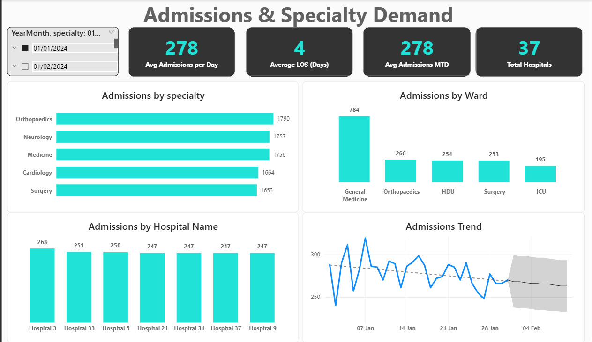
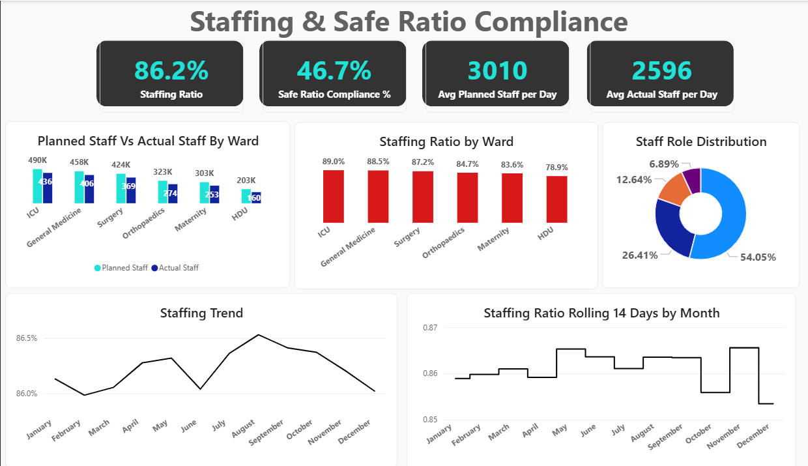

# Horizon Health Network — Bed Demand & Workforce Analytics

A healthcare analytics case study exploring hospital admissions, bed capacity, occupancy and workforce alignment across a 37-hospital network.

> **Portfolio Project by Iheanyi Okwara — Data Analyst**

🌐 **[View Interactive Case Study](https://healthcare-bed-demand.bolt.host)**

---

## Project Overview

Horizon Health Network is a fictional private healthcare provider operating 37 hospitals across the UK.

The organisation needed better visibility into bed availability as capacity planning was affected by fluctuating patient demand, emergency admissions, elective activity, discharge patterns and workforce availability.

Operational information was distributed across admissions, bed inventory and staffing datasets, making it difficult to obtain a consolidated view of demand, capacity and workforce performance.

This project brings these datasets together into a structured analytical model and Power BI reporting solution designed to support capacity and workforce decision-making.

---

## Business Questions

The analysis focused on several operational questions:

- What does patient demand look like across hospitals, specialties and wards?
- How effectively is available bed capacity being utilised?
- How many beds are staffed, occupied, available or closed?
- How closely does actual staffing align with planned staffing?
- How frequently are safe staffing requirements being met?
- Which wards show the largest staffing gaps?
- What patterns should operational teams investigate further?

---

## Key KPIs

| KPI | Result |
|---|---:|
| Average Admissions per Day | **278** |
| Average Length of Stay | **4 days** |
| Hospitals | **37** |
| Average Bed Occupancy | **86.2%** |
| Average Available Beds | **544** |
| Average Staffed Beds per Day | **5,097** |
| Average Occupied Beds | **4,400** |
| Average Closed Beds per Day | **154** |
| Actual-to-Planned Staffing Ratio | **86.2%** |
| Safe Ratio Compliance | **46.7%** |
| Average Planned Staff per Day | **3,010** |
| Average Actual Staff per Day | **2,596** |
| Average Staffing Gap per Day | **414** |

---

## Data

The project integrates three operational datasets:

| Dataset | Description |
|---|---|
| `admissions.csv` | Patient admissions, discharges, admission type, specialty, ward, bed type and length of stay |
| `bed_inventory.csv` | Bed inventory, staffed beds, occupied beds and closed beds by ward and time |
| `staffing.csv` | Planned staffing, actual staffing, staff role and safe-ratio compliance |

The datasets used for this portfolio project are project/synthetic data and do not contain real patient-identifiable information.

---

## Data Model

The analytical model uses a star-schema approach with dimension and fact tables.

### Dimension Tables
- `Dim_Date`
- `Dim_Ward`
- `Dim_Hospital`
- `Dim_StaffRole`

### Fact Tables
- `Fact_Admissions`
- `Fact_BedInventory`
- `Fact_Staffing`

SQL was used to structure the model, create dimension keys, construct fact tables and perform data-quality and referential-integrity checks.

---

## Analytical Workflow

**1. Data Ingestion**  
Imported admissions, bed inventory and staffing datasets for analysis.

**2. Data Cleaning**  
Reviewed missing values, field consistency and dimension-key alignment.

**3. Data Modelling**  
Created dimension and fact tables to support a structured analytical model.

**4. Exploratory Analysis**  
Investigated admissions, specialty demand, ward activity, bed utilisation and staffing patterns.

**5. KPI Development**  
Developed operational measures covering admissions, occupancy, bed availability, staffing and safe-ratio compliance.

**6. Power BI Dashboard**  
Built interactive dashboard pages for demand, bed capacity and workforce performance.

**7. Insights & Recommendations**  
Translated analytical findings into operational areas for further investigation and decision support.

---

## Power BI Dashboard

### Admissions & Specialty Demand



This dashboard examines daily admissions, length of stay, specialty demand, ward demand and hospital-level activity.

### Bed Capacity & Occupancy


This dashboard provides visibility into bed occupancy, available capacity, staffed beds, occupied beds, closed beds and occupancy trends.

### Staffing & Safe Ratio Compliance



This dashboard compares planned and actual staffing, safe-ratio compliance, ward-level staffing ratios and workforce trends.

---

## Key Findings

Average bed occupancy across the reporting period was **86.2%**, while the network averaged **544 available beds** per day.

The network recorded an average of **5,097 staffed beds** and **4,400 occupied beds**, alongside an average of **154 closed beds per day**. Closed-bed availability should be investigated alongside operational and workforce information rather than attributed to a single cause without further evidence.

Actual staffing averaged **86.2% of planned staffing**, with approximately **2,596 actual staff compared with 3,010 planned staff per day**.

Safe staffing requirements were met in **46.7%** of recorded observations, indicating that average staffing levels alone do not fully describe workforce coverage.

Among the analysed wards, **HDU recorded the lowest staffing ratio at 79%**, highlighting it as an appropriate area for further operational review.

---

## Recommendations

### 1. Make Safe Staffing Compliance a Primary KPI
Track safe staffing compliance alongside average staffing ratios so that overall averages do not obscure periods or wards where staffing requirements are not met.

### 2. Prioritise HDU Staffing Review
Investigate HDU workforce requirements, rota coverage and demand patterns because it recorded the lowest staffing ratio among the analysed wards.

### 3. Strengthen Seasonal Workforce Planning
Use monthly workforce patterns alongside expected service demand to support forward staffing and rota planning.

### 4. Investigate Closed-Bed Availability
Analyse the reasons beds are recorded as closed and assess operational, workforce and other capacity constraints before determining underlying causes.

### 5. Validate Ward-Level Bed Data
Review unusually uniform ward-level bed patterns to confirm data quality and ensure capacity decisions are based on reliable operational information.

---

## Tools & Technologies

- **SQL** — data modelling, transformation and validation
- **Power BI** — data modelling, DAX, KPI development and dashboard design
- **Excel** — data review and exploratory analysis
- **Git & GitHub** — version control and project documentation
- **Bolt** — interactive web case-study presentation

---

## Repository Structure

```text
Horizon_Health_Network/
├── README.md
├── data/
│   ├── admissions.csv
│   ├── bed_inventory.csv
│   └── staffing.csv
├── sql/
│   └── Horizon Hospital Network_Analysis.sql
├── powerbi/
│   └── Horizon_Health_Network.pbix
├── presentation/
│   └── Horizon_Health_Bed_Demand_Story.pptx
└── screenshots/
    ├── Admission_Specialty_Demand.png
    ├── Bed_Capacity_Occupancy.png
    └── Staffing_Safe_Ratio_Compliance.png
```

---

## Project Files

- **SQL Analysis:** [`sql/Horizon Hospital Network_Analysis.sql`](sql/Horizon%20Hospital%20Network_Analysis.sql)
- **Power BI Dashboard:** [`powerbi/Horizon_Health_Network.pbix`](powerbi/Horizon_Health_Network.pbix)
- **Presentation:** [`presentation/Horizon_Health_Bed_Demand_Story.pptx`](presentation/Horizon_Health_Bed_Demand_Story.pptx)
- **Datasets:** [`data/`](data/)
- **Dashboard Screenshots:** [`screenshots/`](screenshots/)

---

## Explore the Full Case Study

For the complete interactive project story, methodology, analysis, dashboard gallery and recommendations:

**[Horizon Health Network — Interactive Analytics Case Study](https://healthcare-bed-demand.bolt.host)**

---

## About Me

**Iheanyi Okwara**  
Data Analyst | SQL | Python | Power BI | Excel

I transform complex operational datasets into clear, decision-ready insights through data cleaning, exploratory analysis, data modelling, KPI development and interactive dashboard design.

My portfolio includes analytics projects across healthcare, telecommunications, consumer goods, and media & entertainment.

- [LinkedIn](https://www.linkedin.com/in/iheanyi-okwara-analyst)
- [GitHub](https://github.com/iheanyi-okwara)
- Email: okwaraiheanyi@gmail.com

---

*This project was developed as a portfolio case study. Horizon Health Network is a fictional organisation and the analysis should not be interpreted as reporting on an actual healthcare provider.*
