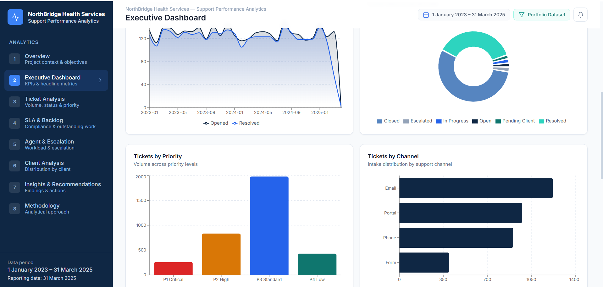
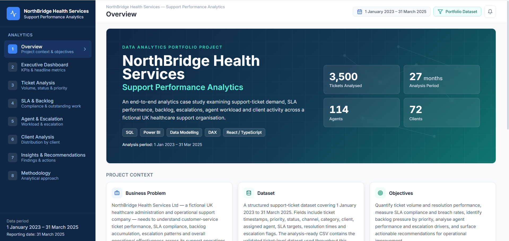
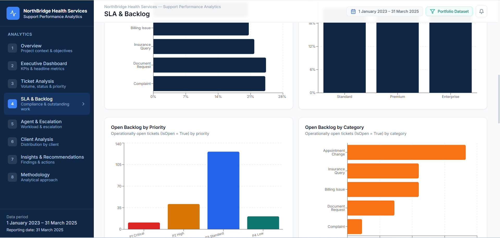
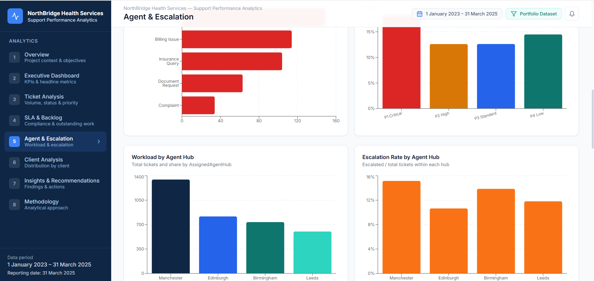
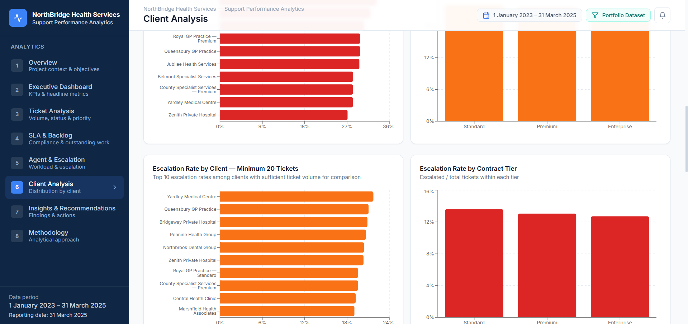
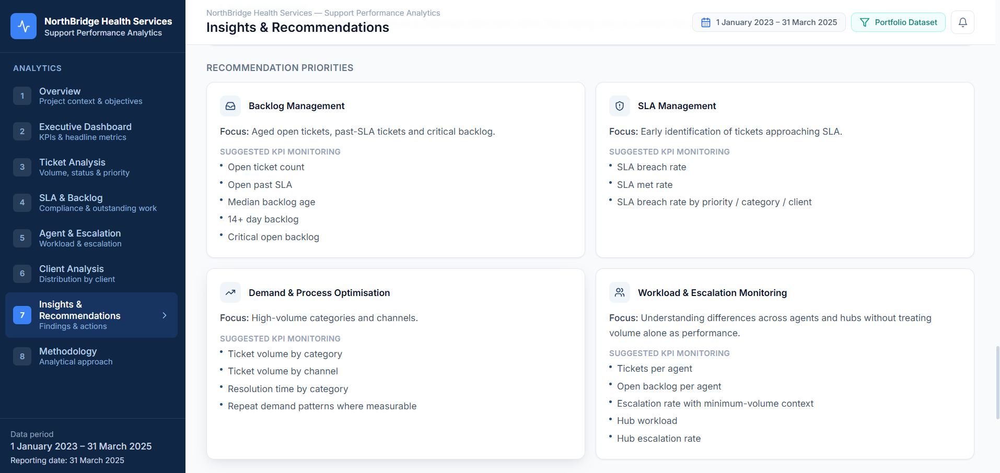

# NorthBridge Health Services — Support Performance Analytics

An end-to-end data analytics portfolio project analysing support ticket performance across a fictional UK healthcare administration and operational support organisation.

The project combines **SQL, Power BI, DAX, Power Query, data modelling, KPI development, data validation, and an interactive React/TypeScript web application** to transform operational support data into management-focused insights.

> **Portfolio Project by Iheanyi Okwara — Data Analyst**

> **Data Disclaimer:** NorthBridge Health Services is a fictional organisation and the dataset used in this project is synthetic. No real patient, clinical, employee, client, or operational data is included.

🌐 **[View Interactive NorthBridge Case Study](https://northbridge-health-analytics.bolt.host/)**

---

## Project Overview

NorthBridge Health Services Ltd is a fictional UK-based healthcare administration and operational support organisation used as the business context for this portfolio case study.

The objective was to analyse support-ticket activity and develop a structured reporting solution that gives management visibility into:

- Ticket demand and operational workload
- Ticket status and priority distribution
- SLA performance
- Backlog volume and ageing
- Escalation patterns
- Agent workload
- Client activity
- Operational trends requiring further investigation

The analysis covers **1 January 2023 to 31 March 2025**, with **31 March 2025** used as the reporting date.

---

## Business Questions

The project was designed to answer several operational questions:

- How much support demand is being generated?
- Which ticket categories and channels account for the greatest volume?
- How frequently are SLA targets being breached?
- What proportion of the operationally open backlog is already past SLA?
- How old is the unresolved backlog?
- Which priority levels show higher escalation activity?
- How is workload distributed across agents?
- Which clients generate the greatest ticket volumes?
- Are there data-quality issues that could distort management reporting?

---

## Dataset

The final analysis-ready dataset contains:

| Metric | Value |
|---|---:|
| Total Tickets | **3,500** |
| Dataset Columns | **46** |
| Unique Ticket IDs | **3,500** |
| Distinct Agents | **114** |
| Distinct Clients | **72** |
| Analysis Period | **Jan 2023 – Mar 2025** |
| Reporting Date | **31 Mar 2025** |

The analytical grain is:

> **One row per support ticket**

Ticket IDs, Agent IDs and Client IDs are used as analytical keys, while descriptive names are retained as display labels.

This distinction was important because duplicate display names existed in the source data and could otherwise produce incorrect aggregations.

---

## Data Architecture

The project preserves both the original source tables and the processed analysis-ready dataset.

### Raw Data

The raw layer includes:

- `Agents.csv`
- `Clients.csv`
- `EscalationLog.csv`
- `PriorityLevels.csv`
- `SLADefinitions.csv`
- `TicketAuditLog.csv`
- `TicketCategories.csv`
- `Tickets.csv`

### Processed Data

The final analytical dataset is:

`northbridge_ticket_analysis.csv`

A separate `data_dictionary.xlsx` provides supporting documentation for the dataset.

This raw-to-processed structure preserves the source data while providing a clean analytical layer for SQL and Power BI reporting.

---

## Tools & Technologies

| Tool | Purpose |
|---|---|
| **SQL** | Data exploration, quality checks, transformation and analytical querying |
| **Power BI** | Data modelling, KPI development and interactive dashboard development |
| **DAX** | Measures and business calculations |
| **Power Query** | Data preparation and transformation |
| **React / TypeScript** | Interactive portfolio web application |
| **Bolt** | Development and deployment of the web presentation layer |
| **Git / GitHub** | Version control and project documentation |

---

## Analytical Workflow

The project followed an end-to-end analytics workflow:

1. **Business Understanding**
2. **Data Exploration**
3. **Data Quality Assessment**
4. **SQL Analysis**
5. **Data Modelling**
6. **KPI Development**
7. **Power BI Dashboard Development**
8. **Validation & Insights**
9. **Interactive Portfolio Presentation**

Analytical calculations were developed and validated before being presented through the Power BI dashboard and interactive web application.

---

## SQL Analysis

SQL was used to explore, validate and analyse the support-ticket data before dashboard development.

The analysis was organised around six main areas.

### 1. Data Exploration & Quality

- Dataset structure
- Row counts
- Unique identifiers
- Missing values
- Duplicate checks
- Category distributions
- Data consistency

### 2. Ticket Performance

- Ticket volumes
- Status distribution
- Priority distribution
- Ticket categories
- Support channels
- Monthly trends

### 3. SLA & Backlog Performance

- SLA compliance
- SLA breaches
- Resolution performance
- Open tickets
- Tickets past SLA
- Backlog ageing

### 4. Escalation & Agent Analysis

- Escalated tickets
- Escalation rates
- Priority-level escalation
- Agent workload
- Hub-level activity

### 5. Client & Business Analysis

- Client ticket volumes
- SLA performance by client
- Escalation activity
- Contract-tier analysis
- Open-ticket activity

### 6. KPI Dataset & Power BI Preparation

- Analysis-ready fields
- KPI validation
- Reporting measures
- Dashboard preparation

---

# Key Performance Indicators

| KPI | Result |
|---|---:|
| Total Tickets | **3,500** |
| SLA Breaches | **754** |
| SLA Breach Rate | **21.54%** |
| SLA Met Rate | **78.46%** |
| Escalated Tickets | **464** |
| Escalation Rate | **13.26%** |
| Operationally Open Tickets | **199** |
| Open Tickets Past SLA | **196** |
| Critical Open Backlog | **11** |
| Average First Response Time | **5.1 hours** |
| Average Resolution Time | **40.9 hours** |

Rates are calculated using the appropriate eligible population for each KPI rather than assuming a universal denominator.

---

# Power BI Dashboard

The Power BI report transforms the analytical outputs into an interactive business intelligence solution covering:

- Executive KPIs
- Ticket volume and distribution
- SLA performance
- Backlog analysis
- Agent workload
- Escalation analysis
- Client activity
- Operational trends
- Analytical findings and recommendations

DAX measures were used to calculate and validate key business metrics while maintaining filter context throughout the report.

---

## Executive Dashboard



The Executive Dashboard provides a management-level overview of ticket demand, SLA performance, backlog and key operational indicators.

---

## Overview



The Overview page provides a broader view of support-ticket activity and operational performance across the reporting period.

---

## SLA & Backlog Analysis



The SLA and Backlog dashboard examines SLA breaches, unresolved tickets, overdue workload and backlog ageing.

---

## Agent & Escalation Analysis



This dashboard explores workload distribution, escalation activity and priority-level escalation patterns.

Agent-level calculations use **AssignedAgentID** rather than descriptive agent names to maintain analytical accuracy.

---

## Client Analysis



The Client Analysis dashboard examines ticket demand and operational activity across clients while preserving Client ID as the analytical key.

---

## Insights & Recommendations



This dashboard summarises the principal analytical findings and evidence-based areas for management consideration.

---

# Key Analytical Findings

## SLA & Backlog

The analysis identified **754 SLA breaches**, representing a **21.54% breach rate**.

Of the **199 operationally open tickets**, **196 were already past SLA** as of the reporting date.

This means approximately **98.49% of the operationally open backlog** was beyond SLA.

Backlog ageing showed:

- **170 of 199 open tickets** were aged 14 days or more
- This represented **85.43%** of the open backlog
- Average open-ticket age: **261.3 days**
- Median open-ticket age: **176.54 days**
- Critical open backlog: **11 tickets**

These results identify areas for operational review without assuming causes that are not supported by the dataset.

---

## Ticket Demand

Ticket demand analysis showed:

- **Appointment Change** was the largest ticket category with **1,200 tickets**
- This represented approximately **34.29%** of all tickets
- **Email** was the largest support channel with **1,221 tickets**
- Email represented approximately **34.89%** of total ticket volume
- **258 tickets** were classified as P1 Critical

These results provide visibility into where support demand is concentrated.

---

## Escalation & Agent Analysis

The dataset contains **114 distinct agents**.

Key findings include:

- **464 tickets** were escalated
- Overall escalation rate: **13.26%**
- Average ticket volume per agent: **30.70**
- Highest individual agent ticket volume: **71 tickets**
- P1 Critical escalation rate: **18.22%**

Agent-level analysis uses **AssignedAgentID** as the grouping key rather than agent name.

This was particularly important because two different agents shared the display name **Parveen Campbell**.

Using Agent ID prevented these separate individuals from being incorrectly combined into one analytical record.

Agent workload and escalation measures are presented as operational indicators and are **not treated as employee performance ratings**.

---

## Client Analysis

The dataset contains **72 distinct Client IDs**.

Key client-level findings include:

- Average ticket volume per client: **48.61**
- Highest-volume client: **Bridgeway Private Hospital**
- Highest individual client ticket volume: **67 tickets**

Client analysis uses **ClientID** as the analytical key because multiple Client IDs can share the same descriptive ClientName.

This prevents similarly named clients from being incorrectly aggregated.

---

## Contract Tier Analysis

| Contract Tier | Tickets | SLA Breach Rate | Escalation Rate | Open Tickets |
|---|---:|---:|---:|---:|
| Standard | 1,662 | 21.90% | 13.60% | 97 |
| Premium | 1,295 | 21.39% | 13.05% | 64 |
| Enterprise | 543 | 20.81% | 12.71% | 38 |

These figures describe observed differences in the synthetic dataset and should not be interpreted as evidence that contract tier itself caused those differences.

---

# Key Findings at a Glance

The analysis identified several important patterns:

- **21.54%** of tickets breached SLA
- **98.49%** of the operationally open backlog was already past SLA
- **85.43%** of open tickets were aged at least 14 days
- P1 Critical tickets had an **18.22% escalation rate**
- Appointment Change accounted for **34.29%** of ticket volume
- Email accounted for **34.89%** of ticket volume
- Manchester recorded the largest ticket volume among the operational hubs
- Agent and client analysis required ID-based grouping to prevent errors caused by duplicate descriptive names

These observations identify areas for further operational investigation rather than establishing unsupported causal relationships.

---

# Recommendations

Based on the observed patterns, the analysis proposes several areas for management consideration.

### 1. Prioritise the Aged Backlog

Review operationally open tickets already beyond SLA and prioritise the oldest and highest-priority cases.

### 2. Investigate SLA Breach Patterns

Analyse recurring characteristics associated with SLA breaches to identify potential workflow or service-management issues requiring further investigation.

### 3. Review High-Volume Ticket Categories

Examine workflows surrounding categories such as Appointment Change to determine whether process improvements could reduce avoidable support demand.

### 4. Monitor Critical-Priority Escalations

Review escalation patterns for P1 Critical tickets and assess whether additional operational controls or earlier interventions are appropriate.

### 5. Review Workload Distribution

Assess workload distribution across agents and operational hubs while avoiding the use of ticket counts alone as employee performance measures.

### 6. Monitor High-Volume Clients

Track clients generating high ticket volumes and investigate recurring support requirements.

### 7. Maintain ID-Based Analytical Models

Continue using Agent IDs, Client IDs and Ticket IDs as analytical keys to protect reporting accuracy where descriptive names are duplicated.

### 8. Establish Regular KPI Reviews

Introduce recurring monitoring of SLA performance, backlog ageing, escalations and unresolved ticket volumes.

These recommendations are analytical suggestions based on the synthetic dataset and are not intended as prescriptive operational decisions.

---

# Data Quality & Validation

Validation was an important part of the project.

Checks included:

- Confirming **3,500 rows**
- Confirming **3,500 unique Ticket IDs**
- Checking duplicate identifiers
- Reviewing missing values
- Validating status and priority distributions
- Confirming KPI calculations
- Checking SLA denominators
- Validating agent-level grouping
- Validating client-level grouping
- Reviewing backlog-age calculations
- Cross-checking dashboard values against analytical outputs

Missing values were handled according to analytical context.

For example, tickets without valid response or resolution timestamps were excluded from the respective average-time calculations rather than being treated as zero.

---

# Interactive Web Application

A separate interactive portfolio application was developed using **React and TypeScript** and deployed using **Bolt**.

The application presents the analysis through:

1. Overview
2. Executive Dashboard
3. Ticket Analysis
4. SLA & Backlog
5. Agent & Escalation
6. Client Analysis
7. Insights & Recommendations
8. Methodology

🌐 **[Launch NorthBridge Health Analytics](https://northbridge-health-analytics.bolt.host/)**

The web application complements the Power BI analysis by presenting the project as an accessible interactive case study.

---

# Repository Structure

```text
NorthBridge_Analytics/
├── README.md
├── data/
│   ├── raw/
│   │   ├── Agents.csv
│   │   ├── Clients.csv
│   │   ├── EscalationLog.csv
│   │   ├── PriorityLevels.csv
│   │   ├── README.csv
│   │   ├── SLADefinitions.csv
│   │   ├── TicketAuditLog.csv
│   │   ├── TicketCategories.csv
│   │   └── Tickets.csv
│   ├── processed/
│   │   └── northbridge_ticket_analysis.csv
│   └── data_dictionary.xlsx
├── sql/
│   └── NorthBridge_Health_Services_SQL_Analysis_Streamlined.sql
├── powerbi/
│   └── NorthBridge Health Services Project.pbix
├── presentation/
│   └── NorthBridge_Health_Services_Analytics_Story.pptx
└── screenshots/
    ├── Overview.png
    ├── executive-dashboard.png
    ├── sla-backlog.png
    ├── agent-escalation.png
    ├── client-analysis.png
    └── Insight-recommendations.png
```

---

# Project Deliverables

### SQL Analysis
**[View SQL Analysis](./sql/NorthBridge_Health_Services_SQL_Analysis_Streamlined.sql)**

### Power BI Dashboard
**[Download Power BI Project](./powerbi/NorthBridge%20Health%20Services%20Project.pbix)**

### Analytics Presentation
**[View Analytics Presentation](./presentation/NorthBridge_Health_Services_Analytics_Story.pptx)**

### Processed Dataset
**[View Analysis-Ready Dataset](./data/processed/northbridge_ticket_analysis.csv)**

### Raw Data
**[Explore Raw Dataset](./data/raw/)**

### Data Dictionary
**[View Data Dictionary](./data/data_dictionary.xlsx)**

### Dashboard Screenshots
**[Explore Dashboard Screenshots](./screenshots/)**

---

# Limitations

This project has several important limitations:

- NorthBridge Health Services is a fictional organisation
- The dataset is synthetic
- Results demonstrate analytical methodology rather than actual organisational performance
- Observed relationships should not be interpreted as causal relationships
- No external operational benchmarks were assumed
- Recommendations would require further operational validation before implementation in a real organisation
- The project contains no real patient or clinical information

---

# About Me

**Iheanyi Okwara**  
Data Analyst | SQL | Python | Power BI | Excel

I transform complex operational datasets into clear, decision-ready insights through data cleaning, exploratory analysis, data modelling, KPI development and interactive dashboard design.

My portfolio includes analytics projects across healthcare, telecommunications, consumer goods, and media & entertainment.

- **[LinkedIn](https://www.linkedin.com/in/iheanyi-okwara-analyst)**
- **[GitHub](https://github.com/iheanyi-okwara)**
- **Email:** okwaraiheanyi@gmail.com

---

# Explore the Full Case Study

🌐 **[NorthBridge Health Services — Interactive Analytics Case Study](https://northbridge-health-analytics.bolt.host/)**

---

*This project was developed for data analytics portfolio and learning purposes using synthetic data.*
