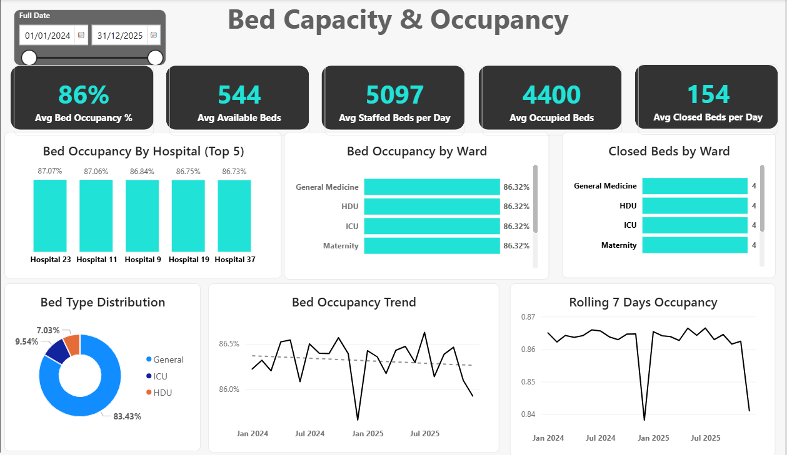

# Iheanyi Okwara — Data Analytics Portfolio

Welcome to my data analytics portfolio.

I am a **Data Analyst** skilled in **SQL, Python, Power BI and Advanced Excel**, with hands-on experience transforming complex operational datasets into clear, decision-ready insights.

My portfolio demonstrates practical experience in **data cleaning, exploratory data analysis, data modelling, KPI development, dashboard design, data validation and analytical storytelling** across healthcare, telecommunications, consumer goods, and media & entertainment.

---

## Technical Skills

**Data Analysis:** SQL • Python • Pandas • Advanced Excel  
**Business Intelligence:** Power BI • DAX • Power Query • Data Modelling  
**Analytics:** Exploratory Data Analysis • KPI Development • Data Quality • Operational Analytics  
**Visualisation:** Interactive Dashboards • Business Reporting • Data Storytelling  
**Development & Version Control:** Git • GitHub

---

# Featured Projects

## 1. Horizon Health Network — Bed Demand & Workforce Analytics

An end-to-end healthcare analytics case study examining **patient demand, bed capacity, occupancy and workforce performance across a fictional 37-hospital network**.

The project integrates admissions, bed inventory and staffing data into a structured analytical model and Power BI reporting solution to improve visibility into hospital capacity and workforce alignment.

### Key KPIs

| KPI | Result |
|---|---:|
| Average Admissions per Day | **278** |
| Average Length of Stay | **4 days** |
| Average Bed Occupancy | **86.2%** |
| Average Available Beds | **544** |
| Actual-to-Planned Staffing Ratio | **86.2%** |
| Safe Ratio Compliance | **46.7%** |
| Average Daily Staffing Gap | **414** |

### Dashboard



### Tools

`SQL` `Power BI` `DAX` `Excel` `Data Modelling` `Git` `GitHub`

### Explore Horizon

📊 **[Full GitHub Case Study](./Horizon_Health_Network/README.md)**  
🌐 **[Interactive Case Study](https://healthcare-bed-demand.bolt.host/)**  
📁 **[Project Files](./Horizon_Health_Network/)**

---

## 2. NorthBridge Health Services — Support Performance Analytics

An end-to-end operational analytics project analysing **support-ticket demand, SLA performance, backlog ageing, escalations, agent workload and client activity** for a fictional UK healthcare administration and operational support organisation.

The project combines raw operational datasets, SQL analysis, Power BI, DAX, data validation and an interactive web application to transform service-management data into management-focused insights.

### Key KPIs

| KPI | Result |
|---|---:|
| Total Tickets | **3,500** |
| SLA Breaches | **754** |
| SLA Breach Rate | **21.54%** |
| SLA Met Rate | **78.46%** |
| Escalated Tickets | **464** |
| Escalation Rate | **13.26%** |
| Operationally Open Tickets | **199** |
| Open Tickets Past SLA | **196** |
| Average First Response Time | **5.1 hours** |
| Average Resolution Time | **40.9 hours** |

### Dashboard


### Analytical Highlights

- **98.49%** of the operationally open backlog was already past SLA at the reporting date.
- **85.43%** of open tickets were aged at least 14 days.
- Appointment Change accounted for **34.29%** of ticket volume.
- Email accounted for **34.89%** of total ticket volume.
- P1 Critical tickets recorded an **18.22% escalation rate**.
- ID-based agent and client analysis was used to prevent incorrect aggregation caused by duplicate descriptive names.

### Tools

`SQL` `Power BI` `DAX` `Power Query` `React` `TypeScript` `Git` `GitHub`

### Explore NorthBridge

📊 **[Full GitHub Case Study](./NorthBridge_Analytics/README.md)**  
🌐 **[Interactive Case Study](https://northbridge-health-analytics.bolt.host/)**  
📁 **[Project Files](./NorthBridge_Analytics/)**

---

# Additional Analytics Projects

The portfolio is being expanded with three additional end-to-end analytical case studies.

## 3. Network Outage Root-Cause Analysis

**Industry:** Telecommunications

Analysis of network outage patterns, service disruption and operational drivers to identify recurring failure patterns and support root-cause investigation.

**Focus Areas:** Outage Analysis • Root-Cause Analysis • Network Performance • Operational Reporting

`SQL` `Python` `Power BI`

**Status:** Portfolio case study packaging in progress.

---

## 4. Production Downtime Analysis

**Industry:** Consumer Goods / Manufacturing

Analysis of production downtime to identify recurring causes, operational patterns and opportunities for process improvement.

**Focus Areas:** Downtime Analysis • Operational Efficiency • Process Performance • KPI Reporting

`Excel` `Power BI` `Data Analysis`

**Status:** Portfolio case study packaging planned.

---

## 5. Viewer Engagement Analytics

**Industry:** Media & Entertainment

Analysis of viewer behaviour and engagement patterns to understand content performance and audience activity.

**Focus Areas:** Engagement Analysis • Content Performance • Audience Behaviour • Data Visualisation

`SQL` `Excel` `Power BI`

**Status:** Portfolio case study packaging planned.

---

# End-to-End Analytics Workflow

My portfolio projects demonstrate an end-to-end analytical workflow:

**Business Understanding → Data Exploration → Data Cleaning → Data Quality Validation → Data Modelling → Exploratory Analysis → KPI Development → Dashboard Development → Insights → Recommendations**

The objective is not simply to create visualisations, but to transform complex datasets into reliable information that can support practical business decisions.

---

# What My Projects Demonstrate

Across these projects, I demonstrate experience in:

- Cleaning and preparing structured datasets
- Writing analytical SQL queries
- Performing exploratory data analysis
- Identifying and resolving data-quality issues
- Building analytical data models
- Developing business KPIs
- Writing DAX measures
- Creating interactive Power BI dashboards
- Validating analytical outputs
- Identifying operational patterns and trends
- Communicating findings without overstating causality
- Translating analysis into practical recommendations
- Documenting projects professionally using Git and GitHub
- Presenting technical analysis through accessible portfolio case studies

---

# Portfolio Structure

```text
data-analysis-projects/
│
├── Horizon_Health_Network/
│   ├── data/
│   ├── powerbi/
│   ├── presentation/
│   ├── screenshots/
│   ├── sql/
│   └── README.md
│
├── NorthBridge_Analytics/
│   ├── data/
│   ├── powerbi/
│   ├── presentation/
│   ├── screenshots/
│   ├── sql/
│   └── README.md
│
├── DA_With_Python/
│
├── assets/
│   ├── cv/
│   └── images/
│
└── README.md
```

Additional project directories will be added as the remaining portfolio case studies are completed.

---

# About Me

I am a Data Analyst with skills in **SQL, Python, Power BI and Advanced Excel** and hands-on experience transforming complex operational datasets into decision-ready insights.

My analytical work includes **data cleaning, exploratory analysis, data modelling, KPI development, dashboard design, data validation and business-focused reporting**.

My portfolio spans multiple industries, demonstrating how the same core analytical principles can be applied to different operational and business problems.

---

# Professional Development

My continuing professional development includes:

- Google Data Analytics Professional Certificate
- Microsoft Power BI Desktop for Business Intelligence
- SQL for Data Analysis
- Python Pandas for Data Analysis
- Microsoft Excel
- Microsoft Azure Fundamentals (AZ-900) training

I continue to develop my knowledge of **business intelligence, cloud data technologies, analytics engineering and data-driven decision support**.

---

# Contact

### Iheanyi Okwara

**Data Analyst**  
Canterbury, England, United Kingdom

📧 **Email:** okwaraiheanyi@gmail.com  
💼 **[LinkedIn](https://www.linkedin.com/in/iheanyi-okwara-analyst)**  
💻 **[GitHub](https://github.com/iheanyi-okwara)**

---

# Portfolio Progress

| Project | Industry | GitHub Case Study | Interactive Case Study |
|---|---|:---:|:---:|
| Horizon Health Network | Healthcare | ✅ | ✅ |
| NorthBridge Health Services | Healthcare Operations | ✅ | ✅ |
| Network Outage RCA | Telecommunications | 🔄 | 🔄 |
| Production Downtime | Consumer Goods | 🔄 | 🔄 |
| Viewer Engagement | Media & Entertainment | 🔄 | 🔄 |

---

*This repository contains portfolio and learning projects. Fictional organisations and synthetic datasets are identified within the relevant project documentation.*
