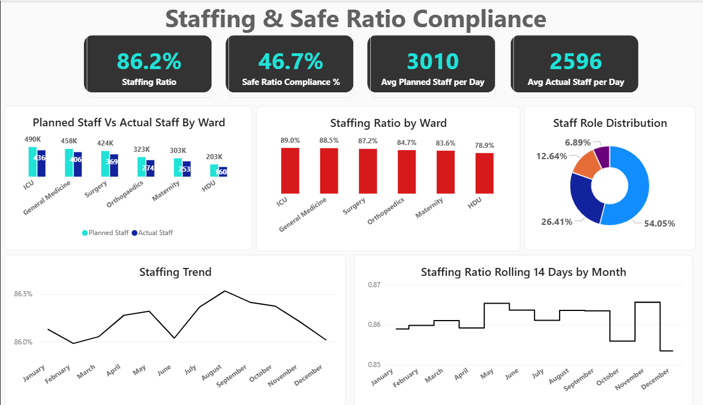

# 📊 Iheanyi Okwara — Data Analytics Portfolio

Welcome to my Data Analytics portfolio.

I am a **Data Analyst** with hands-on experience using **SQL, Python, Power BI, Advanced Excel, DAX, Power Query, data modelling, data visualisation, and business intelligence** to transform complex datasets into actionable insights.

This repository contains end-to-end analytics projects across **healthcare operations, healthcare service management, telecommunications, network reliability, SLA performance, customer impact, operational efficiency, and business reporting**.

My projects demonstrate the complete analytics workflow:

**Data Validation → Data Cleaning → SQL/Python Analysis → Data Modelling → DAX → Power BI → Business Insights → Recommendations → Executive Communication**

---

## 🛠️ Technical Skills

| Area | Tools & Skills |
|---|---|
| Data Analysis | SQL, Python, Pandas, Advanced Excel |
| Business Intelligence | Power BI, DAX, Power Query |
| Data Visualisation | Power BI, Excel, Python |
| Data Modelling | Star Schema, Fact & Dimension Tables, Relationships |
| Database Analysis | SQL, T-SQL |
| Reporting | KPI Development, Dashboard Design, Executive Reporting |
| Version Control | Git, GitHub |
| Cloud Fundamentals | Microsoft Azure Fundamentals |
| Business Analysis | Root Cause Analysis, SLA Analysis, Operational Performance, Process Improvement |

---

# 🚀 Featured Projects

These projects demonstrate end-to-end analytical workflows across **healthcare and telecommunications**, from data validation and modelling through dashboard development, business analysis, recommendations, and executive communication.

---

## 📡 Telecom Network Outage & Reliability Analytics


### Overview

End-to-end telecom network reliability analysis covering **500 network sites, 5 vendors, and 12 UK regions**.

The project analyses **5,000 network outage incidents**, **15,000 alarm records**, SLA assessments, customer complaints, trouble tickets, and maintenance activity to identify the operational factors affecting network reliability and service performance.

### Key Findings

- **Hardware Failure** was the leading reliability issue, generating **1,076 outages** and **826.5 hours of downtime**.
- London accounted for approximately **26% of network outages** and **27% of total downtime**.
- Overall formal SLA compliance was **80.50%**.
- **4,750 of 5,000 outage incidents** had associated alarms.
- Only **30.28% of alarms** were automatically resolved.
- Critical alarms recorded the longest average first-alarm time at **11.2 minutes**.
- Customer complaint resolution rate was **84.55%**.
- Emergency maintenance recorded the lowest maintenance completion rate at **91.8%**.

### Business Value

The analysis identifies opportunities to improve **hardware reliability, regional network performance, vendor management, SLA compliance, alarm automation, high-priority ticket resolution, and preventive maintenance**.

### Tools

**SQL | T-SQL | Power BI | DAX | Data Modelling | PowerPoint | Git/GitHub**

### Explore the Project

➡️ [View Full Telecom Network Outage Analytics Project](Telecom_Network_Outage_Analytics/README.md)

---

## 🏥 Horizon Health Network — Healthcare Bed Demand Analytics


### Overview

End-to-end healthcare analytics project focused on **hospital bed demand, capacity, occupancy, staffing, patient flow, and operational planning**.

The analysis covers **37 hospitals and 200,000 admissions**, providing a data-driven view of how patient demand, bed availability, staffing levels, and safe staffing compliance interact across the hospital network.

### Key Performance Indicators

| KPI | Result |
|---|---:|
| Hospitals | 37 |
| Admissions Analysed | 200,000 |
| Average Bed Occupancy | 86.2% |
| Actual-to-Planned Staffing | 86.2% |
| Safe-Ratio Compliance | 46.7% |
| Average Available Beds | 544 |
| Average Daily Admissions | 278 |
| Average Length of Stay | ~4.17 days |
| Average Closed Beds per Day | 154 |

### Bed Capacity & Occupancy


The capacity analysis evaluates **bed availability, occupancy pressure, closed-bed capacity, and utilisation patterns** to support better understanding of hospital capacity constraints.

With average bed occupancy at **86.2%**, the analysis provides visibility into how closely available capacity is being utilised across the network.

### Admission & Speciality Demand


The admissions analysis examines **patient demand and speciality-level activity**, helping identify patterns in hospital utilisation and areas where demand may place additional pressure on available resources.

Average daily admissions were approximately **278**, while average length of stay was approximately **4.17 days**.

### Staffing & Safe-Ratio Compliance



The staffing analysis compares workforce availability with operational requirements.

Actual staffing averaged approximately **86.2% of planned staffing**, while safe-ratio compliance was **46.7%**, highlighting an important operational area for workforce and capacity planning.

### Business Value

The analysis provides decision support for:

- Bed-capacity planning
- Hospital utilisation monitoring
- Patient-demand forecasting
- Staffing-resource planning
- Safe staffing assessment
- Closed-bed reduction initiatives
- Operational performance management
- Healthcare resource allocation

### Tools

**SQL | Power BI | DAX | Power Query | Data Modelling | Healthcare Analytics | PowerPoint | Git/GitHub**

### Explore the Project

➡️ [View Full Horizon Health Network Project](Horizon_Health_Network/README.md)

### Live Interactive Case Study

➡️ [View Horizon Health Network Case Study](https://healthcare-bed-demand.bolt.host)

---

## 🏥 NorthBridge Health Services Analytics


### Overview

End-to-end healthcare administrative service-desk analytics project analysing **ticket performance, SLA compliance, backlog, response times, resolution performance, escalation, and operational workload**.

The project analyses **3,500 service tickets across 114 agents and 72 clients** to identify service-delivery bottlenecks, backlog risk, SLA performance, and opportunities for operational improvement.

### Key Performance Indicators

| KPI | Result |
|---|---:|
| Total Tickets | 3,500 |
| Resolved Tickets | 1,317 |
| Open Tickets | 2,183 |
| Resolution Rate | 37.6% |
| SLA Breached | 754 |
| SLA Breach Rate | 21.5% |
| Avg. First Response | 5.06 hrs |
| Avg. Resolution Time | 40.86 hrs |
| Escalated Tickets | 464 |
| Escalation Rate | 13.3% |
| Open Past SLA | 2,180 |
| Critical Backlog | 2,158 |
| Avg. Backlog Age | 409.2 days |

### Key Findings

- Only **37.6% of tickets** were resolved during the reporting period.
- **754 tickets (21.5%)** breached SLA.
- **2,180 of 2,183 open tickets** were already past SLA.
- The critical backlog reached **2,158 tickets**.
- Average backlog age was approximately **409.2 days**.
- Average first-response time was **5.06 hours**.
- Average resolution time was **40.86 hours**.
- **464 tickets** were escalated, representing **13.3%** of all tickets.

### Business Value

The analysis highlights opportunities to improve:

- Backlog management
- SLA compliance
- Ticket prioritisation
- Agent workload management
- Escalation processes
- Response and resolution performance
- Service-desk operational efficiency

### Tools

**SQL | Power BI | DAX | Excel | Data Modelling | Business Analysis | PowerPoint | Git/GitHub**

### Explore the Project

➡️ [View Full NorthBridge Analytics Project](NorthBridge_Analytics/README.md)

### Live Interactive Case Study

➡️ [View NorthBridge Health Services Case Study](https://northbridge-health-analytics.bolt.host)

---

# 🐍 Additional Analytics Work

## Data Analysis with Python

Python-based analytical work demonstrating **data cleaning, transformation, exploratory data analysis, and analytical workflows** using Python and Pandas.

📂 [Explore Python Analytics Projects](DA_With_Python/)

---

# 💼 What These Projects Demonstrate

Across these projects, I apply analytics to real-world business problems by:

- Validating and cleaning source data before analysis
- Designing structured analytical data models
- Writing SQL queries for KPI calculation and exploratory analysis
- Using Python and Pandas for data analysis and transformation
- Developing DAX measures for business reporting
- Building interactive Power BI dashboards
- Performing root-cause and operational performance analysis
- Analysing SLA and service-performance metrics
- Identifying operational risks, bottlenecks, and performance gaps
- Translating analytical results into business findings
- Developing evidence-based recommendations
- Creating implementation roadmaps
- Communicating insights through executive presentations
- Building interactive analytical case studies
- Documenting projects professionally using Git and GitHub

---

# 🎯 Areas of Interest

I am particularly interested in opportunities involving:

- Data Analytics
- Business Intelligence
- Healthcare Analytics
- Operational Analytics
- Performance Reporting
- Data Visualisation
- Process Improvement
- Data Quality
- KPI & SLA Reporting
- SQL & Database Analysis
- Power BI Development

---

# 📂 Portfolio Structure

```text
data-analysis-projects/
│
├── Telecom_Network_Outage_Analytics/
│   ├── data/
│   ├── powerbi/
│   ├── presentation/
│   ├── screenshots/
│   ├── sql/
│   └── README.md
│
├── Horizon_Health_Network/
│   ├── data/
│   ├── powerbi/
│   ├── presentation/
│   ├── screenshots/
│   ├── sql/
│   └── README.md
│
├── NorthBridge_Analytics/
│   ├── data/
│   ├── powerbi/
│   ├── screenshots/
│   ├── sql/
│   └── README.md
│
├── DA_With_Python/
│
└── README.md
```

---

# 📊 Featured Portfolio Summary

| Project | Domain | Primary Focus | Key Tools |
|---|---|---|---|
| 📡 Telecom Network Outage & Reliability Analytics | Telecommunications | Outages, SLA, alarms, vendors, customer impact & maintenance | SQL, Power BI, DAX |
| 🏥 Horizon Health Network | Healthcare Operations | Bed demand, occupancy, capacity & staffing | SQL, Power BI, DAX |
| 🏥 NorthBridge Health Services | Healthcare Administration | Tickets, SLA, backlog & service performance | SQL, Power BI, DAX |
| 🐍 Data Analysis with Python | General Analytics | Data cleaning, transformation & EDA | Python, Pandas |

---

# 📫 Connect With Me

**Iheanyi Okwara**  
**Data Analyst**

**LinkedIn:** [Iheanyi Okwara](https://www.linkedin.com/in/iheanyi-okwara-90a3842a9)

**GitHub:** [iheanyi-okwara](https://github.com/iheanyi-okwara)

---

## 📌 Portfolio Development

This portfolio demonstrates my progression through increasingly comprehensive end-to-end analytics projects across different business domains.

The three flagship case studies — **Horizon Health Network, NorthBridge Health Services, and Telecom Network Outage & Reliability Analytics** — demonstrate my ability to work across the complete analytics lifecycle:

**Business Problem → Data Validation → Data Analysis → Data Modelling → Dashboard Development → Insight Generation → Recommendations → Executive Communication**

The objective of each project is not simply to create dashboards, but to demonstrate how data can be transformed into **clear, measurable, and actionable business insight**.
