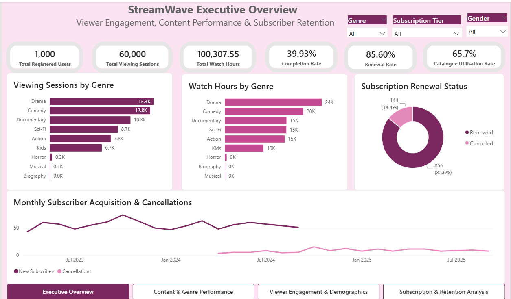
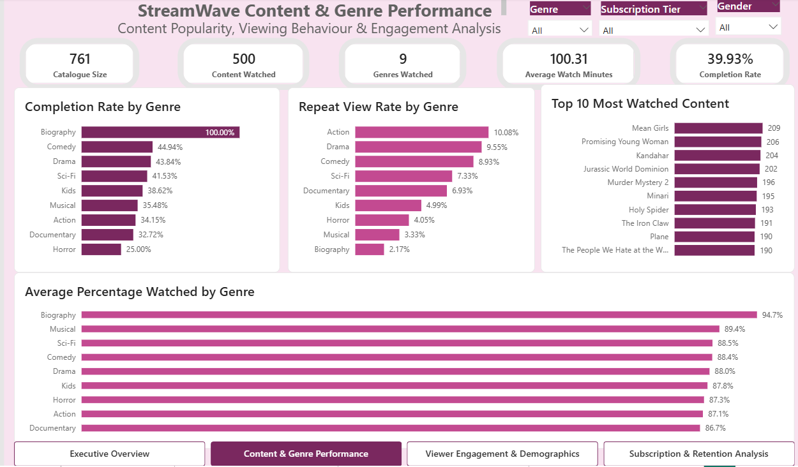
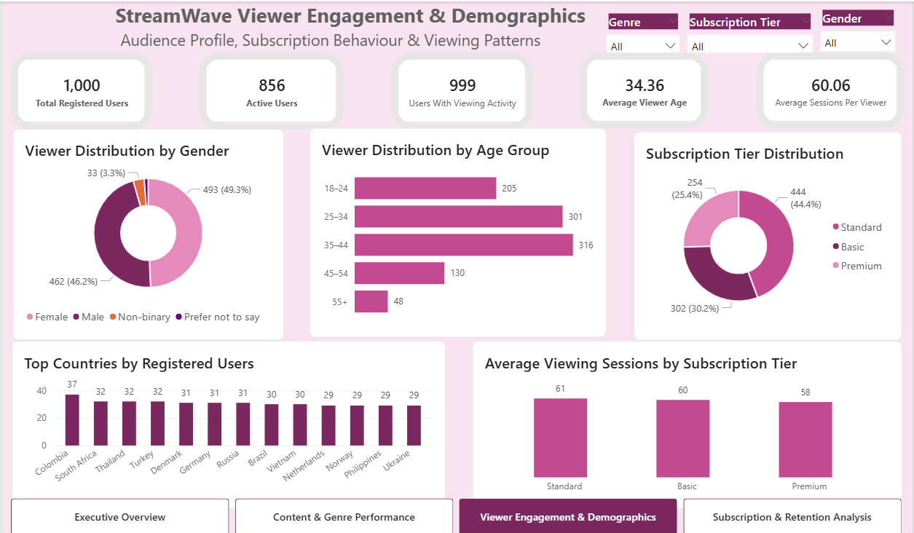
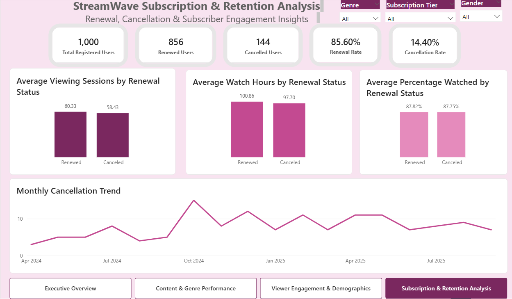

# StreamWave Viewer Engagement & Retention Analytics

## Project Overview

StreamWave is a viewer engagement and subscription retention analytics project designed to explore how users interact with streaming content, identify content performance patterns, understand audience demographics, and assess patterns associated with subscriber renewal and cancellation.

The project combines **SQL Server** for data preparation and analysis with **Power BI, Power Query, and DAX** for data modelling, KPI development, interactive analysis, and business storytelling.

The analysis covers:

- **1,000** registered users
- **60,000** viewing sessions
- **761** catalogue titles
- **500** titles watched
- **9** watched genres
- **100,307.55** total watch hours

---

## Business Problem

StreamWave needs to understand:

1. Which genres and titles generate the strongest viewer engagement?
2. How effectively is the available content catalogue being utilised?
3. Are viewers completing the content they start?
4. Who are StreamWave's viewers and how do different audience segments behave?
5. How does engagement differ across subscription tiers?
6. How do renewed and cancelled subscribers differ in viewing behaviour?
7. What patterns can help inform future retention and content strategies?

---

## Tools & Technologies

- SQL Server
- SQL Server Management Studio (SSMS)
- Power BI
- Power Query
- DAX
- Data Modelling
- Data Visualisation
- Business Intelligence
- Data Storytelling

---

## Data Model

The StreamWave relational model contains four core tables:

- `users`
- `subscriptions`
- `movie_list`
- `viewing_activity`

The model connects user information, subscription status, content metadata, and individual viewing sessions to support analysis across viewer, content, engagement, and retention dimensions.

---

## Key Performance Indicators

| KPI | Result |
|---|---:|
| Registered Users | 1,000 |
| Active Users | 856 |
| Users With Viewing Activity | 999 |
| Viewing Sessions | 60,000 |
| Total Watch Hours | 100,307.55 |
| Average Watch Minutes | 100.31 |
| Catalogue Size | 761 |
| Content Watched | 500 |
| Catalogue Utilisation | 65.7% |
| Genres Watched | 9 |
| Completion Rate | 39.93% |
| Renewal Rate | 85.60% |
| Cancellation Rate | 14.40% |

---

## Power BI Dashboard

The StreamWave Power BI dashboard consists of four interactive pages covering executive performance, content engagement, viewer demographics, and subscriber retention.

### 1. Executive Overview

Provides a high-level view of viewing activity, watch hours, content completion, catalogue utilisation, renewal performance, and subscriber trends.



### 2. Content & Genre Performance

Explores content popularity and engagement across genres, including completion rates, repeat viewing, most-watched titles, and average percentage watched.



### 3. Viewer Engagement & Demographics

Analyses the StreamWave audience across age, gender, country, subscription tier, and viewing frequency.



### 4. Subscription & Retention Analysis

Compares renewed and cancelled subscribers and examines viewing frequency, watch hours, viewing depth, renewal performance, and monthly cancellation trends.



---

## Key Business Insights

### Strong Overall Retention

StreamWave achieved an **85.60% renewal rate**, with **856 of 1,000 subscribers** renewing.

### Drama Drives the Greatest Engagement

Drama generated **13,277 viewing sessions** and **24,332.67 watch hours**, making it the strongest genre by both viewing volume and total watch time.

### Comedy Performs Strongly on Completion

Comedy recorded a **44.94% completion rate**, the strongest completion performance among the major high-volume genres.

### Action Encourages Repeat Viewing

Action recorded the highest repeat-view rate among the major genres at **10.80%** based on the SQL analysis.

### Catalogue Utilisation Presents an Opportunity

Only **500 of 761 titles** generated viewing activity, representing approximately **65.7% catalogue utilisation**. This means **261 titles had no recorded viewing activity**.

### Viewer Completion Remains an Opportunity

Only **39.93% of viewing sessions reached at least 90% of the content duration**, which is the completion threshold used in this analysis.

Average percentage watched and completion rate are separate measures and should not be interpreted as the same KPI.

### Core Audience Is Concentrated Between Ages 25 and 44

The largest audience groups were:

- **25–34:** 301 users
- **35–44:** 316 users

Together they represent **61.7% of registered users**.

### Premium Subscribers Do Not Show the Highest Viewing Frequency

Average viewing sessions per user were approximately:

- **Standard:** 61
- **Basic:** 60
- **Premium:** 58

The difference is modest, but it provides an opportunity to investigate whether Premium subscribers are receiving sufficient perceived value.

### Viewing Behaviour Alone Does Not Explain Cancellation

Renewed viewers averaged **60.33 viewing sessions**, **100.86 watch hours**, and **87.82% average percentage watched**.

Cancelled viewers with viewing activity averaged **58.43 viewing sessions**, **97.70 watch hours**, and **87.75% average percentage watched**.

The differences are relatively small, particularly in viewing depth. Therefore, the analysis does not support the conclusion that lower viewing engagement caused cancellation.

---

## Business Recommendations

1. **Optimise catalogue utilisation** — Review the 261 titles with no recorded viewing activity and determine whether they require stronger promotion, improved discovery, repositioning, or removal at future licensing decisions.
2. **Strengthen high-performing genres** — Continue leveraging Drama and Comedy while using repeat-view behaviour to identify opportunities within Action content.
3. **Improve content completion** — Investigate where viewers stop watching and test features such as personalised recommendations, continue-watching prompts, and improved content discovery.
4. **Investigate Premium engagement** — Explore why Premium subscribers record slightly fewer viewing sessions than Standard and Basic subscribers and assess whether additional Premium benefits could increase perceived value.
5. **Expand retention analysis beyond viewing behaviour** — Incorporate subscription tenure, pricing, payment history, customer service interactions, and cancellation reasons.
6. **Develop retention-risk segmentation** — Combine viewing frequency, recency, watch hours, completion behaviour, and subscription characteristics to identify subscribers who may require targeted retention interventions.

---

## Analytical Considerations

- Completion is defined as a viewing session reaching at least **90% of the content duration**.
- Average percentage watched and completion rate represent different metrics and should not be interpreted interchangeably.
- Biography recorded **100% completion**, but this was based on only **47 sessions and one title**, so the result should be interpreted cautiously.
- Engagement differences between renewed and cancelled subscribers represent associations and should not be interpreted as evidence of causation.
- Subscriber acquisition and cancellation data cover different effective periods. Later negative net subscriber changes should therefore not be interpreted as confirmed subscriber decline.

---

## Project Structure

```text
StreamWave-Viewer-Engagement-Retention-Analytics/
│
├── data/
│   ├── movie_list.csv
│   ├── subscriptions.csv
│   ├── users.csv
│   └── viewing_activity.csv
│
├── powerbi/
│   └── StreamWave_Viewer_Engagement_Retention_Analytics.pbix
│
├── presentation/
│   └── StreamWave_Engagement_Retention_Insights.pptx
│
├── screenshots/
│   ├── 01_Executive_Overview.png
│   ├── 02_Content_Genre_Performance.png
│   ├── 03_Viewer_Engagement_Demographics.png
│   └── 04_Subscription_Retention_Analysis.png
│
├── sql/
│   └── StreamWave_Viewer_Engagement_Retention_Analytics.sql
│
└── README.md
```

---

## Author

**Iheanyi Okwara**  
Data Analyst

**Skills demonstrated:** SQL | Power BI | DAX | Power Query | Data Modelling | Data Visualisation | Business Intelligence | Data Storytelling
