# 📡 Telecom Network Outage & Reliability Analytics

## 📌 Project Overview

This project presents an end-to-end analysis of telecom network outage and operational performance across **500 network sites, 5 vendors, and 12 UK regions**.

The analysis evaluates **5,000 network outage incidents** alongside alarm logs, SLA performance, customer complaints, trouble tickets, and maintenance activity to identify the operational factors contributing to network disruption and service performance.

The project combines **SQL, Power BI, DAX, data modelling, data validation, and business analysis** to transform operational telecom data into actionable insights for network operations and vendor management.

**Data Analyst:** Iheanyi Okwara

**Reporting Period:** FY2024–FY2025

---

## 🎯 Business Problem

Network outages affect service availability, customer experience, operational costs, and SLA performance.
The analysis was designed to answer several key business questions:

- What are the main causes of network outages?
- Which regions and sites experience the greatest outage burden?
- How does network reliability vary across vendors?
- What factors contribute most to SLA non-compliance?
- How effectively are network alarms detected and automatically resolved?
- How are network reliability issues reflected in customer complaints and trouble tickets?
- How effectively is maintenance activity supporting network reliability?
- Where should operational improvement efforts be prioritised?

---

## 🛠️ Tools & Technologies

- **SQL / T-SQL** — data validation, quality checks, KPI analysis and exploratory analysis
- **Power BI** — dashboard development and interactive reporting
- **DAX** — KPI calculations and analytical measures
- **Data Modelling** — fact/dimension relationships and date modelling
- **PowerPoint** — executive presentation and business recommendations
- **Git & GitHub** — version control and project documentation

---

## 📊 Executive Performance Overview

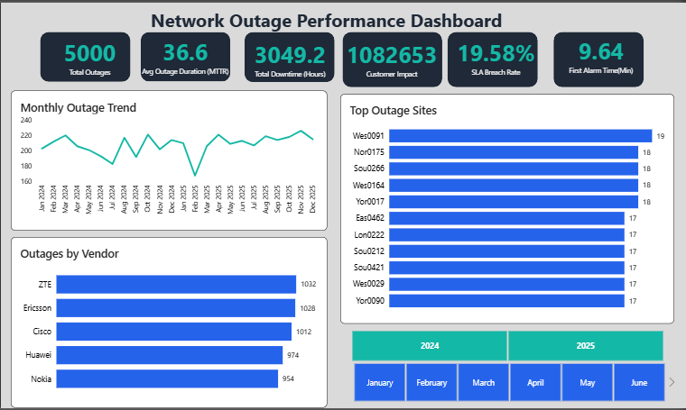

### Key Performance Indicators

| KPI | Result |
|---|---:|
| Total Outages | 5,000 |
| Avg. Outage Duration | 36.6 min |
| Total Downtime | 3,049.2 hrs |
| Aggregated Customer Impact | 1,082,653 |
| Incident-Level SLA Breach Rate | 19.58% |
| Avg. First Alarm Time | 9.64 min |

---

## 🔧 Root Cause Analysis


**Hardware Failure** emerged as the most significant network reliability issue across multiple performance measures.

It accounted for:

- **1,076 outages**
- **826.5 hours of downtime**
- **46.1 minutes average outage duration**
- Approximately **229.1K aggregated customer impact**
- **171 formal SLA non-compliant assessments**

Hardware Failure therefore represents the strongest cross-metric reliability improvement opportunity identified in the analysis.

The three largest outage causes — **Hardware Failure, Power Failure, and Software Failure** — account for approximately **53% of all network outages**.

---

## 🌍 Site & Vendor Performance

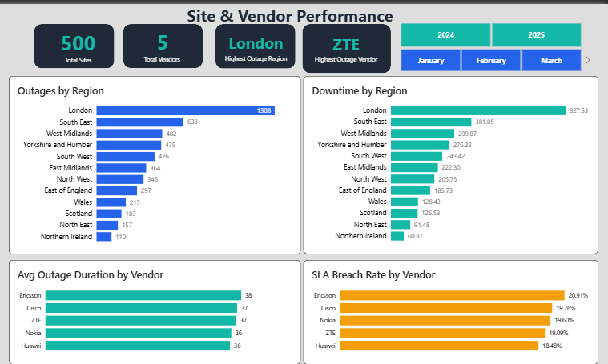

### Regional Performance

London recorded:

- **1,308 outages**
- Approximately **827.5 hours of downtime**
- Around **26% of all network outages**
- Around **27% of total network downtime**

This makes London a clear regional outlier and a priority for deeper investigation into potential contributing factors.

### Vendor Performance

Vendor outage volumes were relatively close, but reliability outcomes differed.

| Vendor | Avg. Outage Duration | Incident SLA Breach Rate |
|---|---:|---:|
| Ericsson | 38 min | 20.91% |
| Cisco | 37 min | 19.76% |
| ZTE | 37 min | 19.09% |
| Nokia | 36 min | 19.60% |
| Huawei | 36 min | 18.48% |

Ericsson recorded the longest average outage duration and highest incident-level SLA breach rate.

The analysis demonstrates why vendor performance should be assessed using multiple reliability measures rather than outage volume alone.

---

## 📍 Site-Level Analysis

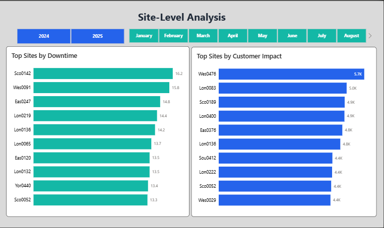

Site risk varies depending on the performance measure used.

- **Sco0142** recorded the highest total downtime at approximately **16.2 hours**.
- **Wes0476** recorded the highest aggregated customer impact at approximately **5.7K**.
- **Lon0136** and **Sco0052** appeared on both the high-downtime and high-customer-impact leaderboards.

These cross-over sites provide strong candidates for targeted asset-condition assessment and operational investigation.

---

## ⏱️ SLA & Service Performance

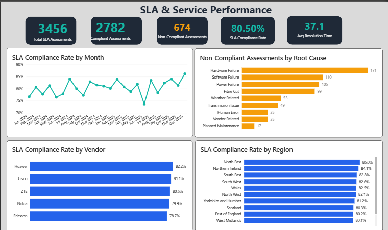

Formal SLA assessments produced:

| KPI | Result |
|---|---:|
| Total SLA Assessments | 3,456 |
| Compliant Assessments | 2,782 |
| Non-Compliant Assessments | 674 |
| SLA Compliance Rate | 80.50% |
| Avg. Resolution Time | 37.1 min |

SLA compliance fluctuated throughout the reporting period rather than following a consistently improving trend.

Hardware Failure produced the largest number of formal SLA non-compliances at **171 assessments**.

### SLA Violation Analysis

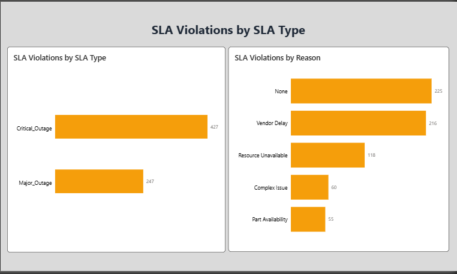

Of the **674 non-compliant assessments**:

- **427** related to Critical Outages
- **247** related to Major Outages
- **216** recorded Vendor Delay as the violation reason
- **118** recorded Resource Unavailable
- **60** recorded Complex Issue
- **55** recorded Part Availability

The dataset also contains **225 records with "None" as the stored violation-reason category**, which should be treated separately from missing data.

Formal SLA compliance also varied by vendor:

| Vendor | Formal SLA Compliance |
|---|---:|
| Huawei | 82.2% |
| Cisco | 81.1% |
| ZTE | 80.5% |
| Nokia | 79.9% |
| Ericsson | 78.7% |

> **Important:** Formal SLA assessment compliance and incident-level SLA breach rate are separate measures with different denominators and should not be interpreted as the same KPI.

---

## 🚨 Alarm & Detection Performance

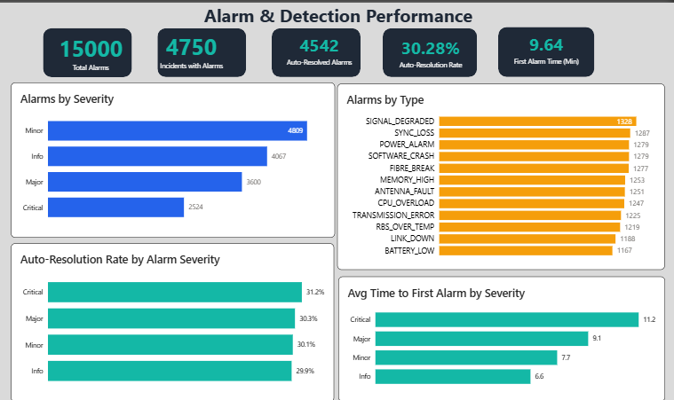

The network generated:

- **15,000 alarms**
- **4,750 incidents with associated alarms**
- **4,542 auto-resolved alarms**
- **30.28% auto-resolution rate**
- **9.64 min average first-alarm time**

Approximately **95% of outage incidents** had an associated alarm.

Critical alarms recorded the longest average first-alarm time:

| Severity | Avg. First Alarm Time |
|---|---:|
| Critical | 11.2 min |
| Major | 9.1 min |
| Minor | 7.7 min |
| Info | 6.6 min |

The analysis uses **First Alarm Time** rather than conventional MTTD because the available data does not contain pre-incident alarms required to calculate a conventional pre-incident detection metric.

### Alarm Detail Analysis

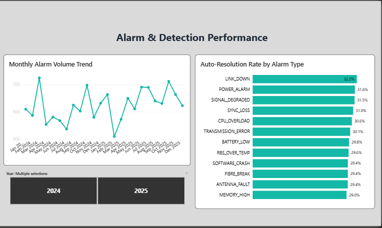

Auto-resolution performance was relatively similar across alarm types, with rates ranging from approximately **29% to 32%**.

This suggests that the opportunity for greater automation is distributed across the monitoring environment rather than being concentrated in a single alarm category.

---

## 👥 Customer & Service Impact

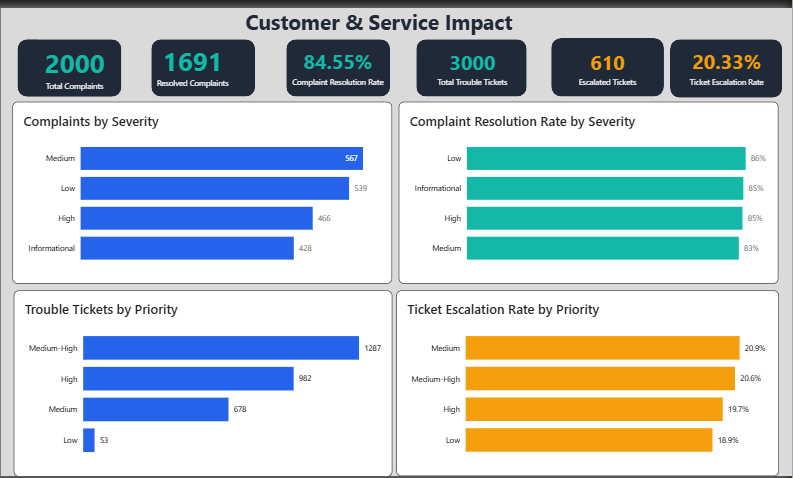

Customer-service records included:

- **2,000 complaints**
- **1,691 resolved complaints**
- **84.55% complaint resolution rate**
- **3,000 trouble tickets**
- **610 escalated tickets**
- **20.33% ticket escalation rate**

### Customer & Ticket Detail

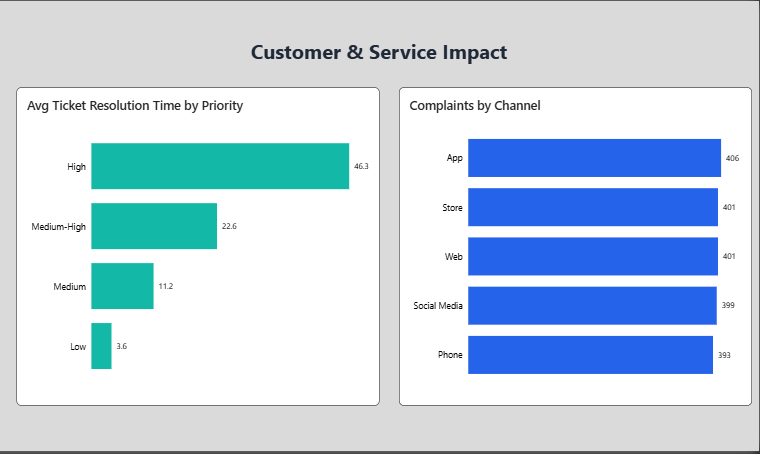

Average trouble-ticket resolution time varied substantially by priority:

| Priority | Avg. Resolution Time |
|---|---:|
| High | 46.3 min |
| Medium-High | 22.6 min |
| Medium | 11.2 min |
| Low | 3.6 min |

High-priority tickets therefore required substantially more resolution time than lower-priority tickets.

Escalation rates remained relatively close across priority groups, ranging from approximately **18.9% to 20.9%**, suggesting escalation was not concentrated solely among the highest-priority tickets.

Complaint volumes were also distributed relatively evenly across App, Store, Web, Social Media, and Phone channels.

---

## 🛠️ Maintenance & Reliability

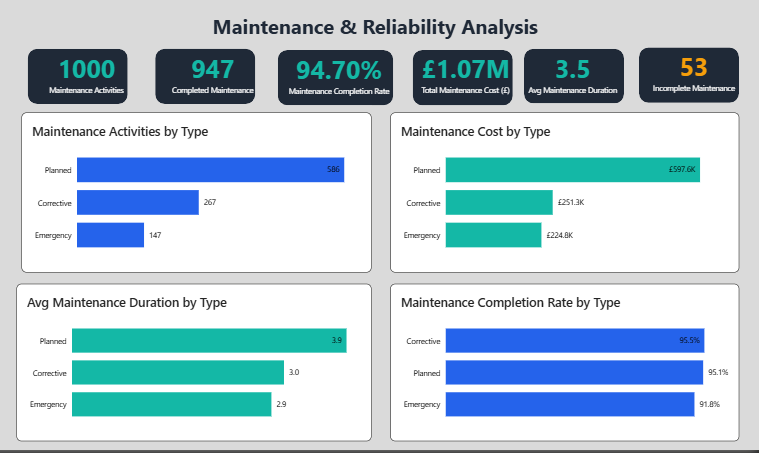

Maintenance performance included:

| KPI | Result |
|---|---:|
| Maintenance Activities | 1,000 |
| Completed Activities | 947 |
| Completion Rate | 94.70% |
| Total Maintenance Cost | £1.07M |
| Avg. Maintenance Duration | 3.5 hrs |
| Incomplete Activities | 53 |

Maintenance completion was high overall, but performance differed by maintenance type.

- **Corrective:** 95.5%
- **Planned:** 95.1%
- **Emergency:** 91.8%

Emergency maintenance therefore recorded the lowest completion rate.

### Vendor Maintenance Analysis

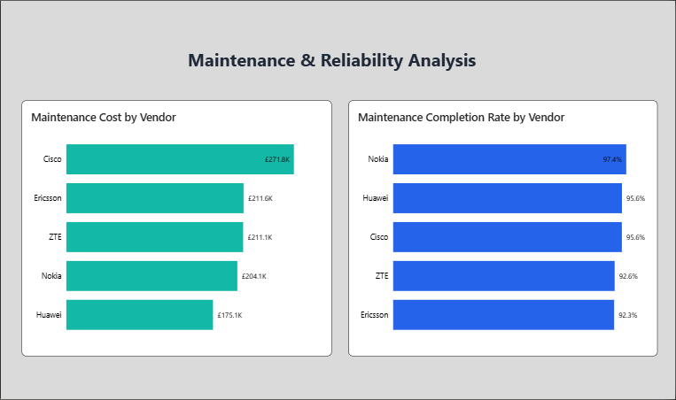

Maintenance expenditure by vendor was:

- **Cisco:** £271.8K
- **Ericsson:** £211.6K
- **ZTE:** £211.1K
- **Nokia:** £204.1K
- **Huawei:** £175.1K

Maintenance completion rates were:

- **Nokia:** 97.4%
- **Huawei:** 95.6%
- **Cisco:** 95.6%
- **ZTE:** 92.6%
- **Ericsson:** 92.3%

Higher maintenance expenditure therefore did not automatically correspond with higher completion performance.

---

## 💡 Key Business Insights

1. **Hardware Failure is the strongest reliability improvement opportunity.** It leads outage frequency, downtime, average duration, aggregated customer impact, and formal SLA non-compliance.

2. **Network disruption is geographically concentrated.** London accounts for approximately 26% of outages and 27% of total downtime.

3. **Vendor reliability cannot be judged by outage volume alone.** Restoration time, SLA performance, maintenance completion, and cost provide important additional context.

4. **Alarm automation remains limited.** Only 30.28% of alarms are automatically resolved, while Critical alarms record the longest average first-alarm time.

5. **High-priority trouble tickets require substantially longer resolution times**, although escalation rates remain relatively similar across priority groups.

6. **Emergency maintenance has the weakest completion performance**, creating an opportunity to investigate whether suitable work can be shifted toward planned or preventive maintenance.

---

## 🎯 Recommendations

### 1. Strengthen Hardware Reliability

Prioritise targeted asset-condition assessment, preventive replacement, and repeat-failure monitoring for hardware-related incidents.

### 2. Investigate London's Outage Concentration

Conduct detailed site-level root-cause analysis before implementing targeted regional remediation.

### 3. Introduce Multi-KPI Vendor Scorecards

Assess vendors using restoration time, SLA performance, maintenance completion, outage impact, and cost efficiency rather than outage volume alone.

### 4. Improve Critical-Alarm Detection & Automation

Review monitoring thresholds, event correlation, alert routing, and opportunities for automated triage and remediation.

### 5. Improve SLA Consistency

Investigate the drivers of formal SLA non-compliance, particularly hardware-related failures and recorded violation reasons.

### 6. Review High-Priority Ticket Workflows

Identify delays across assignment, escalation, specialist intervention, and resolution stages.

### 7. Improve Emergency-Maintenance Readiness

Investigate resource, parts, and vendor-response constraints and identify suitable activities for conversion to planned/preventive maintenance.

### 8. Measure Maintenance Outcomes Alongside Spend

Introduce measures such as cost per completed activity, repeat-failure rate, and post-maintenance reliability.

---

## 🗺️ Implementation Roadmap

### 0–3 Months — Diagnose & Stabilise

- Audit high-impact and repeat-offender sites
- Review vendor SLA performance and contract terms
- Conduct detailed London root-cause investigation
- Review Critical-alarm thresholds and routing

### 3–9 Months — Pilot & Improve

- Pilot automated alarm triage and remediation
- Introduce vendor performance scorecards
- Pilot targeted preventive maintenance at high-risk sites
- Identify emergency work suitable for conversion to planned maintenance

### 9–18 Months — Scale & Optimise

- Scale successful hardware-reliability interventions
- Roll out vendor scorecards across the network
- Expand proven alarm-automation processes
- Re-baseline SLA and maintenance targets using post-intervention performance data

---

## 📁 Project Deliverables

This repository contains the complete analytical workflow.

### 📊 Power BI Report

[Open Power BI Project](powerbi/Telecom_Network_Outage_Analytics.pbix)

Interactive analytical report covering outage performance, root causes, sites, vendors, SLA, alarms, customer impact, tickets, and maintenance.

### 🗄️ SQL Analysis

[View SQL Analysis](sql/Telecom_Network_Outage_Analytics_SQL_Analysis.sql)

T-SQL analysis covering data-quality validation, KPI calculations, root-cause analysis, SLA performance, alarms, customer impact, maintenance, and final validation.

### 📑 Executive Presentation

[Open Executive Presentation](presentation/Telecom_Network_Outage_Analytics.pptx)

Executive business-review presentation translating the analytical findings into recommendations and an implementation roadmap.

### 📂 Data

The `data/` directory contains the dimension and fact tables used to build the analytical model.

### 🖼️ Dashboard Screenshots

The `screenshots/` directory contains the final Power BI dashboard pages used throughout this case study.

---

## 📂 Repository Structure

```text
Telecom_Network_Outage_Analytics/
│
├── README.md
│
├── data/
│   ├── dim_customer_segment.csv
│   ├── dim_date.csv
│   ├── dim_root_cause.csv
│   ├── dim_site.csv
│   ├── dim_vendor.csv
│   ├── fact_alarm_log.csv
│   ├── fact_customer_complaint.csv
│   ├── fact_maintenance.csv
│   ├── fact_outage_incident.csv
│   ├── fact_sla_performance.csv
│   └── fact_trouble_ticket.csv
│
├── powerbi/
│   └── Telecom_Network_Outage_Analytics.pbix
│
├── presentation/
│   └── Telecom_Network_Outage_Analytics.pptx
│
├── screenshots/
│   ├── 01_Executive_Overview.png
│   ├── 02_Root_Cause_Analysis.png
│   ├── 03_Site_Vendor_Performance.png
│   ├── 04_Site_Level_Analysis.png
│   ├── 05_SLA_Service_Performance.png
│   ├── 06_SLA_Violation_Analysis.png
│   ├── 07_Alarm_Detection_Performance.png
│   ├── 08_Alarm_Detail_Analysis.png
│   ├── 09_Customer_Service_Impact.png
│   ├── 10_Customer_Service_Detail.png
│   ├── 11_Maintenance_Reliability.png
│   └── 12_Maintenance_Vendor_Analysis.png
│
└── sql/
    └── Telecom_Network_Outage_Analytics_SQL_Analysis.sql
```

---

## 👤 Data Analyst

**Iheanyi Okwara**

Data Analyst | SQL | Python | Power BI | Excel | Business Intelligence

---

## ✅ Project Status

**Completed**

This project demonstrates an end-to-end analytics workflow covering:

**Data Validation → SQL Analysis → Data Modelling → DAX → Power BI → Business Analysis → Executive Recommendations → Implementation Roadmap**

The objective was not only to build a dashboard, but to translate operational telecom data into clear, measurable business insights that could support network reliability and service-performance decisions.

Outage volumes remained relatively stable throughout the reporting period. Vendor outage volumes were also relatively close, indicating that meaningful differences in vendor performance become more apparent through restoration time and SLA outcomes rather than incident volume alone.